<div align="center">

# ✦ Clarity

### The AI interface toolkit — 150+ React components, a streaming chat SDK, and a client-side token optimizer.

[](https://nextjs.org)
[](https://react.dev)
[](https://typescriptlang.org)
[](https://tailwindcss.com)
[](https://fastapi.tiangolo.com)

<br />

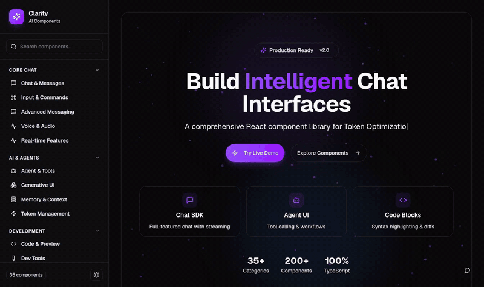

<br />

**Everything you need to build a ChatGPT-grade interface** — streaming chat, tool calling,
generative UI, agent workflows, token budgeting, observability, and 35 categories of
production-ready components you can drop straight into a Next.js app.

</div>

---

## 📑 Contents

- [What is Clarity?](#-what-is-clarity)
- [Take the tour](#-take-the-tour)
- [Quick start](#-quick-start)
- [The Chat SDK](#-the-chat-sdk)
- [SDK DevTools](#-sdk-devtools)
- [Token optimization](#-token-optimization)
- [The stream protocol](#-the-stream-protocol)
- [Component gallery](#-component-gallery)
- [Motion & effects](#-motion--effects)
- [Theming](#-theming)
- [Project structure](#-project-structure)
- [Testing](#-testing)
- [Backend](#-backend)

---

## ✦ What is Clarity?

Clarity is a **full-stack toolkit for AI product interfaces**. It ships three things that
normally take months to build:

| | |
|:--|:--|
| 🧩 **A component library** | 150+ React components across 35 categories — chat bubbles, tool calls, agent traces, canvas editors, code diffs, cost dashboards, safety guardrails. |
| ⚡ **A chat SDK** | The `useAdvancedChat` hook: streaming, generative UI, RAG, middleware, voice, attachments, persistence, and abort/retry — in one hook. |
| 🪙 **A token optimizer** | Client-side context-window management, semantic caching, compression, and RAG that cut tokens *before* you pay for them. |

Plus a live showcase app that renders every single component, so you can browse, search,
and copy the import for anything you see.

---

## 🎬 Take the tour

Every category is one click away in the sidebar. Here's the showcase moving through
chat, agents, platform clones, canvas workflows, charts, tokens, code, and traces:

<div align="center">

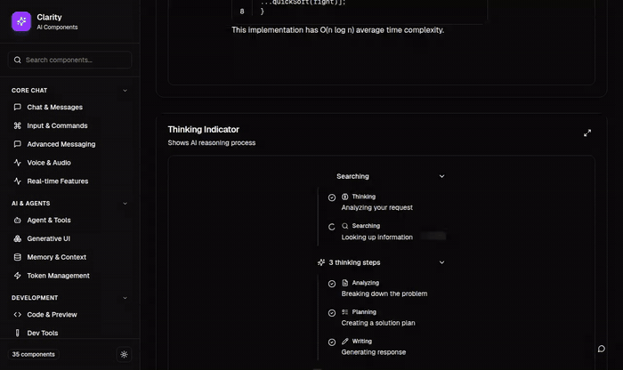

</div>

Search filters all 35 categories as you type:

<div align="center">

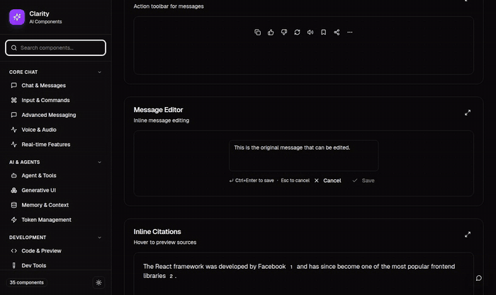

</div>

---

## 🚀 Quick start

```bash
# 1. Install
npm install

# 2. Run the showcase
npm run dev          # → http://localhost:3000
```

Three routes ship out of the box:

| Route | What's there |
|:--|:--|
| `/` | The full component showcase — 35 categories, searchable |
| `/advanced-ai` | Live `useAdvancedChat` demo with DevTools and token optimization |
| `/design-system` | Design tokens, pastel accents, typography, glassmorphism |

To power the chat demo with real streaming, start the backend too — see [Backend](#-backend).

---

## ⚡ The Chat SDK

`useAdvancedChat` is the engine. It handles the stream, the context window, the
middleware chain, and generative UI rendering — you just render messages.

<div align="center">

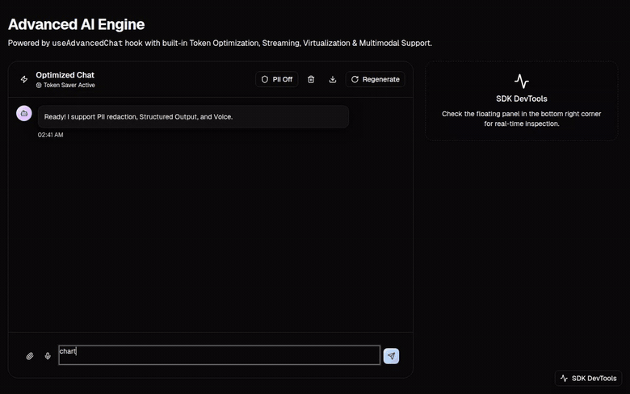

*Typing `chart` streams thinking steps, then a live Recharts component — rendered straight from the stream.*

</div>

```tsx
import { useAdvancedChat } from '@/components/ai/chat/useAdvancedChat';
import { piiRedactionMiddleware } from '@/components/ai/chat/middleware';

export function Chat() {
  const {
    messages, append, isLoading, stop, reload, clear,
    optimizationStats, streamLogs, ragContext, contextWindow,
  } = useAdvancedChat({
    persistenceKey: 'my-chat-v1',
    optimizerConfig: { enabled: true, contextWindow: 4000 },
    initialConfig: {
      systemPrompt: 'You are a helpful assistant. Current date is {{date}}.',
      temperature: 0.7,
      model: 'gpt-5.2',
      provider: 'mock',
    },
    middleware: [piiRedactionMiddleware],
  });

  return (
    <>
      {messages.map(m => <Bubble key={m.id} message={m} />)}
      <Composer onSend={text => append({ role: 'user', content: text })} />
    </>
  );
}
```

**What you get from the hook**

- **Streaming** — line-delimited protocol mixing text, reasoning, and UI components
- **Generative UI** — the model streams `7:{"component":"Chart",...}` and React renders it
- **Thinking steps** — `8:` chunks become a collapsible reasoning timeline
- **Middleware** — `onRequest` / `onResponse` hooks (PII redaction and logging included)
- **RAG** — client-side TF-IDF retrieval, no vector DB required
- **Persistence** — pass `persistenceKey` and history survives reloads
- **Control** — `stop()`, `reload()`, `clear()`, and full `setMessages` access
- **Multimodal** — drag-and-drop attachments, speech-to-text, text-to-speech

---

## 🔬 SDK DevTools

A floating inspector for everything the SDK is doing — token accounting, the RAG context
that got retrieved, raw stream chunks as they arrive, and live config editing.

<div align="center">

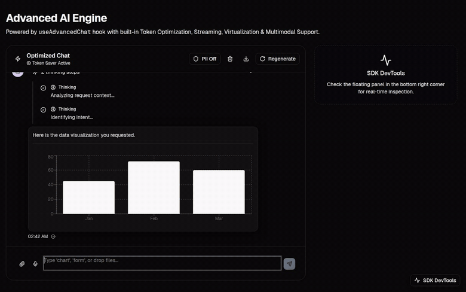

</div>

```tsx
import { SDKDevTools } from '@/components/ai/devtools/SDKDevTools';

<SDKDevTools
  stats={optimizationStats}
  logs={streamLogs}
  ragContext={ragContext}
  config={config}
  onConfigChange={setConfig}
/>
```

---

## 🪙 Token optimization

The optimizer trims context **on the client**, before a request is ever sent. Strategies
compose: sliding window, semantic relevance, or `hybrid`.

```ts
import { TokenOptimizer } from '@/lib/token-optimization';

const optimizer = new TokenOptimizer({
  contextWindow: { maxTokens: 4000, strategy: 'hybrid', keepSystemMessages: true },
  memoryConfig: { shortTermSize: 10, longTermSize: 50, compressionThreshold: 100 },
});

optimizer.rag.addDocument('doc1', 'Next.js is a React framework…', { source: 'docs' });

const { messages, stats } = optimizer.context.optimize(fullHistory);
console.log(`Saved ${stats.saved} tokens`);
```

Thirteen modules ship in `lib/token-optimization/`:

`TokenOptimizer` · `ContextManager` · `SemanticCache` · `KVCache` · `MessageCompressor`
`MarkdownOptimizer` · `JSONOptimizer` · `ChunkingStrategy` · `MemoryManager`
`SmartRouter` · `ToolCalling` · `RAGSystem` · `StreamHandler`

And the UI to visualize all of it:

<table>
<tr>
<td width="50%">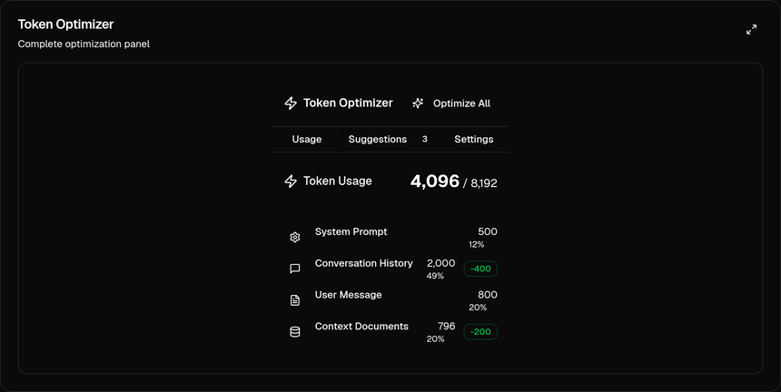</td>
<td width="50%">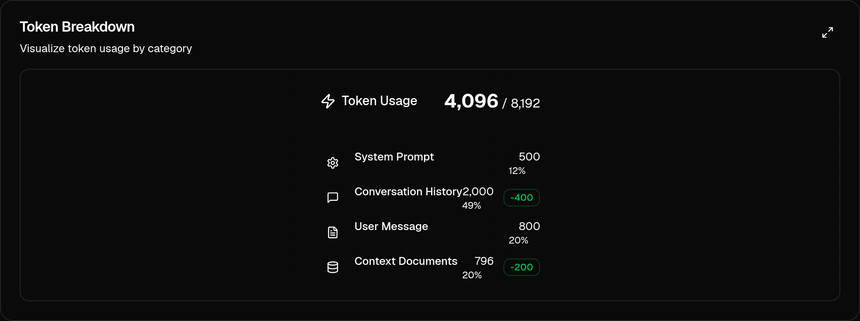</td>
</tr>
<tr>
<td width="50%">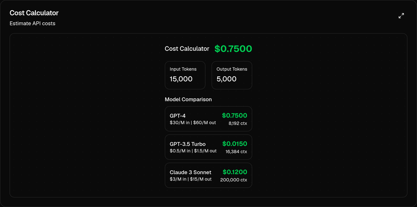</td>
<td width="50%">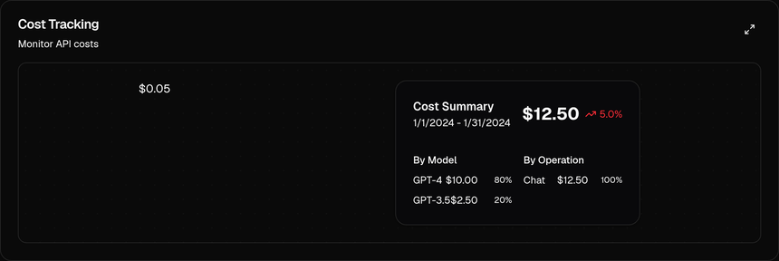</td>
</tr>
</table>

---

## 📡 The stream protocol

One line-delimited format carries text, reasoning, tool calls, and UI instructions
over a single response body.

```
[type]:[content]\n
```

| Code | Type | Payload |
|:--:|:--|:--|
| `0` | Text | Append to the current message |
| `1` | Data | JSON metadata |
| `2` | Tool call start | JSON |
| `3` | Tool call args | String / JSON |
| `4` | Tool call end | — |
| `5` | Error | JSON |
| `6` | Ping | Heartbeat |
| `7` | UI component | JSON — `{ component, props }` |
| `8` | Thinking | Reasoning chunk |

A real exchange from the mock provider:

```
8:Analyzing request context...
8:Identifying intent...
0:Here is the data visualization you requested.
7:{"component": "Chart", "props": {"data": [{"name": "Jan", "value": 45}, …]}}
```

Parsing is handled for you by `lib/streaming/StreamParser.ts`.

---

## 🧩 Component gallery

Thirty-five categories. Here's a taste of each family.

### Platform clones

Faithful references for the interfaces everyone already knows.

<table>
<tr>
<td width="50%">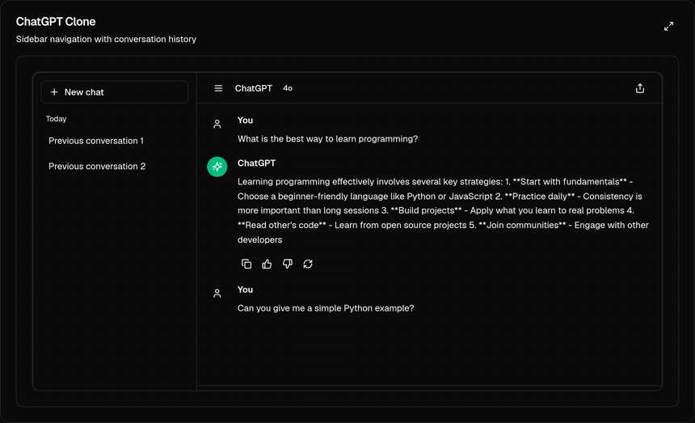</td>
<td width="50%">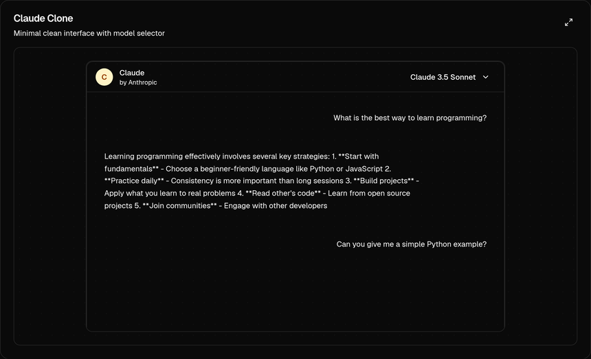</td>
</tr>
<tr>
<td width="50%">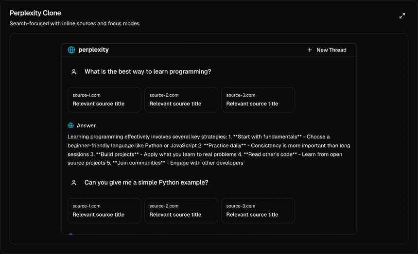</td>
<td width="50%">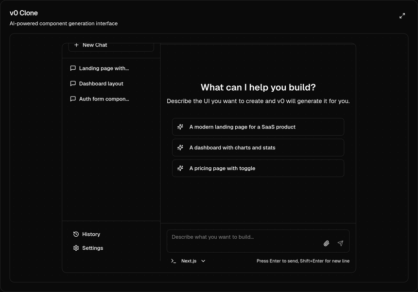</td>
</tr>
</table>

### Agents & tools

Tool calls, sub-agent cards, human-in-the-loop approvals, and execution plans.

<div align="center">

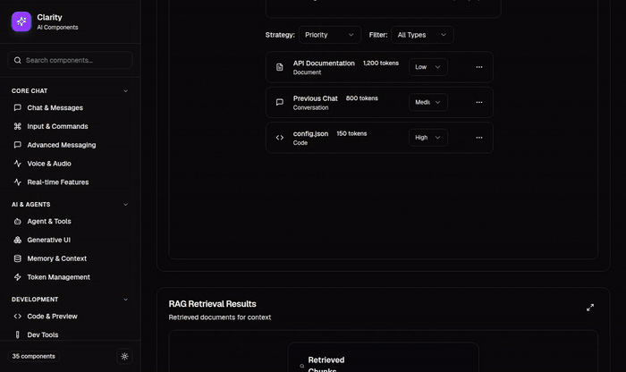

</div>

<table>
<tr>
<td width="50%">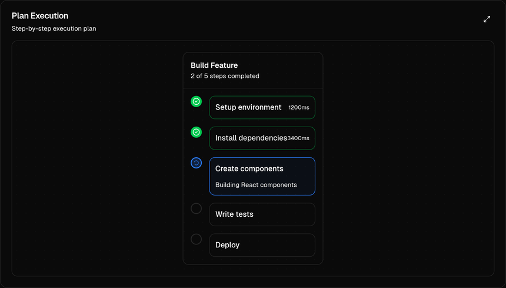</td>
<td width="50%">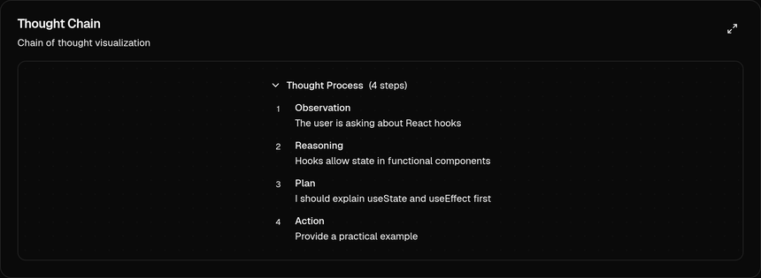</td>
</tr>
</table>

### Canvas & workflow

Node-based editors and diagram surfaces for visual agent building.

<table>
<tr>
<td width="50%">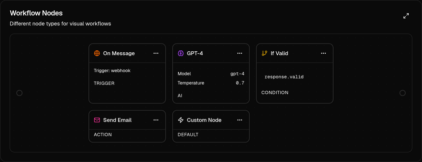</td>
<td width="50%">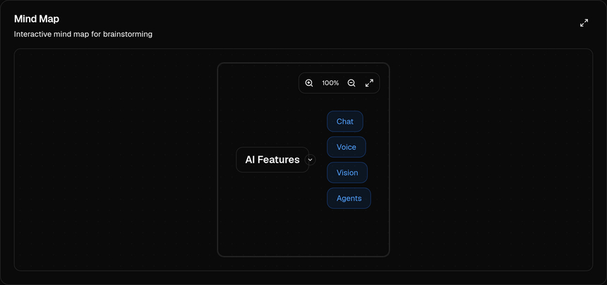</td>
</tr>
</table>

### Code & preview

<table>
<tr>
<td width="50%">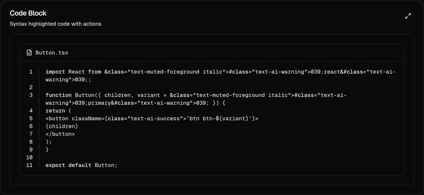</td>
<td width="50%">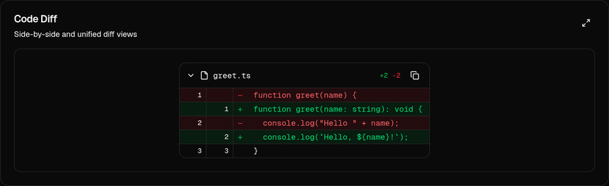</td>
</tr>
<tr>
<td width="50%">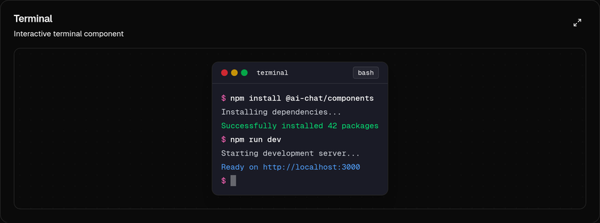</td>
<td width="50%">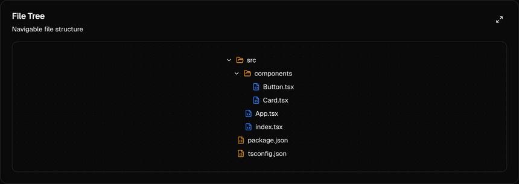</td>
</tr>
</table>

### Safety & observability

Guardrails on the way in, traces on the way out.

<table>
<tr>
<td width="50%">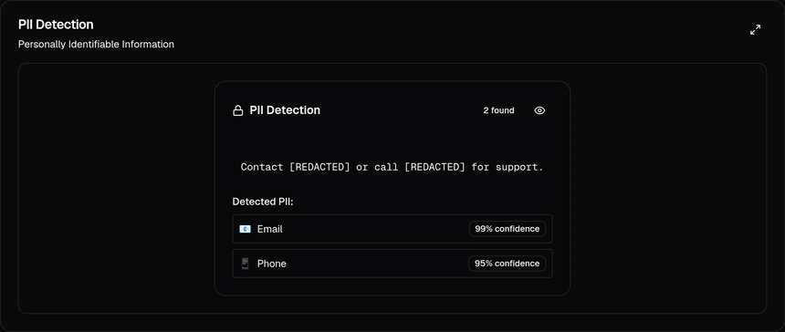</td>
<td width="50%">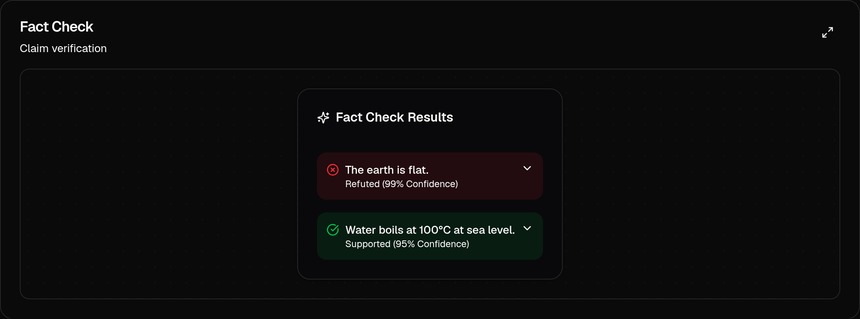</td>
</tr>
<tr>
<td width="50%">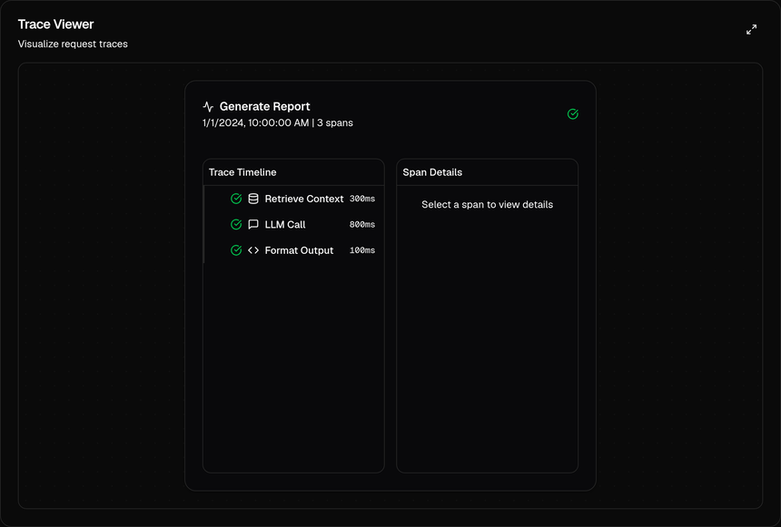</td>
<td width="50%">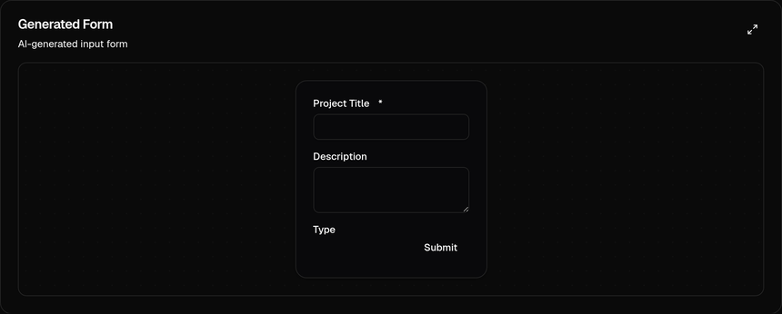</td>
</tr>
</table>

### The full category list

<table>
<tr><td><b>Core Chat</b></td><td>Chat &amp; Messages · Input &amp; Commands · Advanced Messaging · Voice &amp; Audio · Real-time</td></tr>
<tr><td><b>AI &amp; Agents</b></td><td>Agent &amp; Tools · Generative UI · Memory &amp; Context · Token Management</td></tr>
<tr><td><b>Development</b></td><td>Code &amp; Preview · Dev Tools · Prompt Tooling · Canvas &amp; Workflow</td></tr>
<tr><td><b>Data &amp; Media</b></td><td>Data &amp; Charts · Media &amp; Sources · Diagrams &amp; Links</td></tr>
<tr><td><b>UI Foundation</b></td><td>UI Primitives · Loading States · Effects &amp; Animations · UI Patterns</td></tr>
<tr><td><b>Platform &amp; Safety</b></td><td>Platform Clones · Safety &amp; Guardrails · Observability</td></tr>
<tr><td><b>Collaboration</b></td><td>Collaboration · Auth &amp; Profile · Settings</td></tr>
<tr><td><b>More</b></td><td>Layouts · Theming · Speech · Feedback · Threads · Utilities · Translation · Dashboards · Web Search</td></tr>
</table>

---

## 🌠 Motion & effects

Aurora fields, animated beams, spotlight cards, mesh gradients — all pure CSS and Canvas,
no animation library required.

<div align="center">

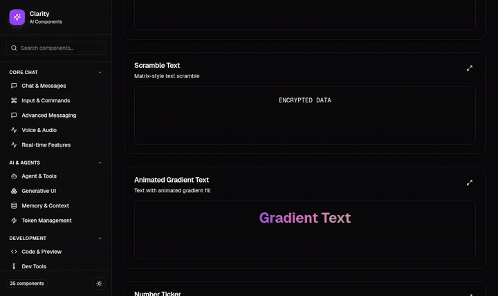

</div>

Text effects for streaming interfaces — typewriter, scramble, number tickers, character reveals:

<div align="center">

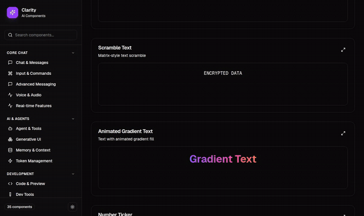

</div>

---

## 🎨 Theming

Every component is built on CSS variables and responds to a single class swap.

<div align="center">

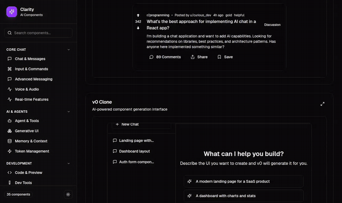

</div>

<table>
<tr>
<td width="50%" align="center"><b>Light</b><br />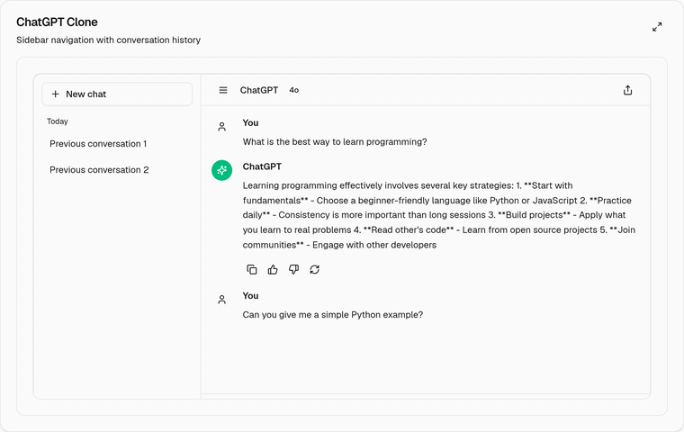</td>
<td width="50%" align="center"><b>Dark</b><br />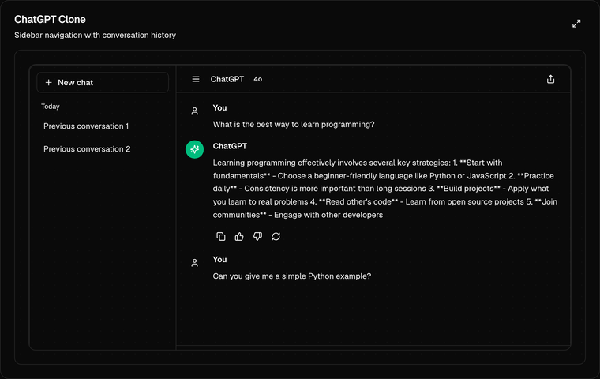</td>
</tr>
</table>

Tokens live in `app/globals.css` — semantic colors, glassmorphism layers, chat bubble
colors, and chart palettes, defined once for each theme.

```css
.glass         /* subtle frosted layer  */
.glass-medium  /* elevated surfaces     */
.glass-heavy   /* modals and overlays   */
```

The `/design-system` route documents the whole scale:

<div align="center">

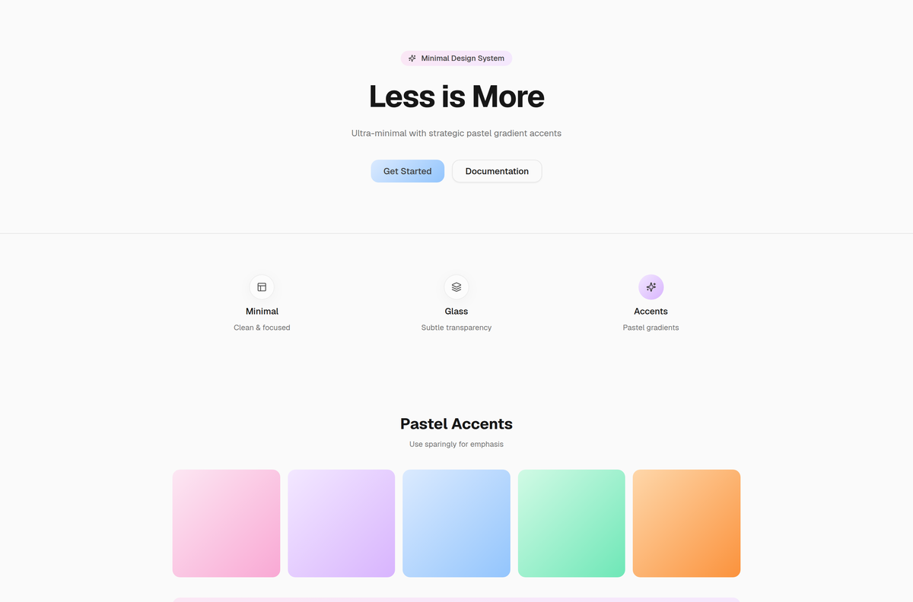

</div>

---

## 📂 Project structure

```
clarity/
├── app/
│   ├── page.tsx              # Component showcase (35 categories)
│   ├── advanced-ai/          # Live SDK demo + DevTools
│   ├── design-system/        # Design tokens & typography
│   └── globals.css           # Theme variables, glass utilities
├── components/
│   ├── ai/                   # 150+ AI components
│   │   ├── chat/             # useAdvancedChat, middleware, voice, TTS
│   │   ├── dashboards/       # Token, context, agent, prompt dashboards
│   │   └── devtools/         # SDKDevTools inspector
│   ├── showcase/             # Demo pages for every category
│   └── ui/                   # 56 shadcn/ui primitives
├── lib/
│   ├── token-optimization/   # 13-module optimizer
│   ├── streaming/            # Protocol, parser, useStream
│   └── design-system.ts
├── backend/                  # FastAPI streaming service
│   ├── server.py
│   ├── chat_service.py
│   └── providers.py          # Mock + LiteLLM adapters
└── tests/
    └── token-optimizer.test.ts
```

---

## 🧪 Testing

```bash
npx tsx tests/token-optimizer.test.ts
```

```
🧪 Running Token Optimizer Tests...

--- Test 1: Context Window Optimization ---
Original Tokens: 638
Optimized Tokens: 499
Saved: 139 (21.8%)
✅ PASS: Context fits within maxTokens
✅ PASS: System message preserved

--- Test 2: Compression ---
Original Length: 2500
Compressed Length: 1999
✅ PASS: Compression reduced size

✨ All tests completed.
```

Type-check and build the whole app:

```bash
npx tsc --noEmit     # strict type check
npm run build        # production build
npm run lint         # eslint
```

---

## 🐍 Backend

A FastAPI service that speaks the stream protocol. The chat route defaults to a **mock
provider**, so the SDK demo works with no API keys at all.

```bash
cd backend
pip install -r requirements.txt

# server.py reads these from backend/.env
export MONGO_URL="mongodb://localhost:27017"
export DB_NAME="clarity"

uvicorn server:app --port 8001 --reload
```

The frontend calls `http://localhost:8001/api/chat/stream` by default; override it with
`NEXT_PUBLIC_BACKEND_URL`.

**Providers** are selected per-request via `config.provider`:

| Value | Adapter |
|:--|:--|
| `mock` *(default)* | Scripted responses — streams thinking steps, charts, forms, and profiles |
| `openai` / `anthropic` / `litellm` | `LiteLLMProvider`, reading `OPENAI_API_KEY` or `EMERGENT_LLM_KEY` |

Adding your own is one subclass of `LLMProvider` in `backend/providers.py`.

---

<div align="center">

**Built with Next.js 16, React 19, TypeScript, Tailwind v4, Radix UI, Recharts, and FastAPI.**

<sub>All screenshots and recordings in this README are captured from the live app in this repository.</sub>

</div>
